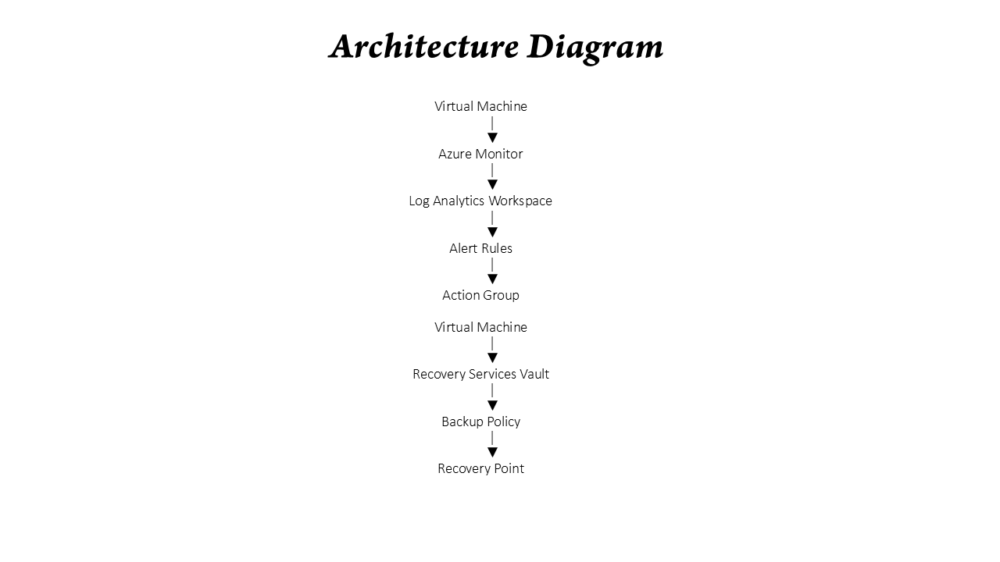

# Azure Monitoring & Disaster Recovery Solution

## Overview
This project demonstrates how to implement monitoring, alerting, backup and disaster recovery for Azure Virtual Machines.

## Architecture

## Azure Services Used

- Azure Virtual Machine
- Azure Monitor
- Log Analytics Workspace
- Alert Rules
- Action Groups
- Recovery Services Vault
- Azure Backup
- Azure Dashboard

## Features

- Real-time Monitoring
- Performance Insights
- Memory Alerts
- Email Notifications
- Automated Backup
- Disaster Recovery Readiness
- Centralized Dashboard

## Screenshots

### Resource Group

### Azure Monitor

### Alert Rule

### Recovery Services Vault

### Backup Success

### Dashboard

## Author

Praveen Kumar
Azure Administrator | AZ-900 & AZ-104 Training Completed
